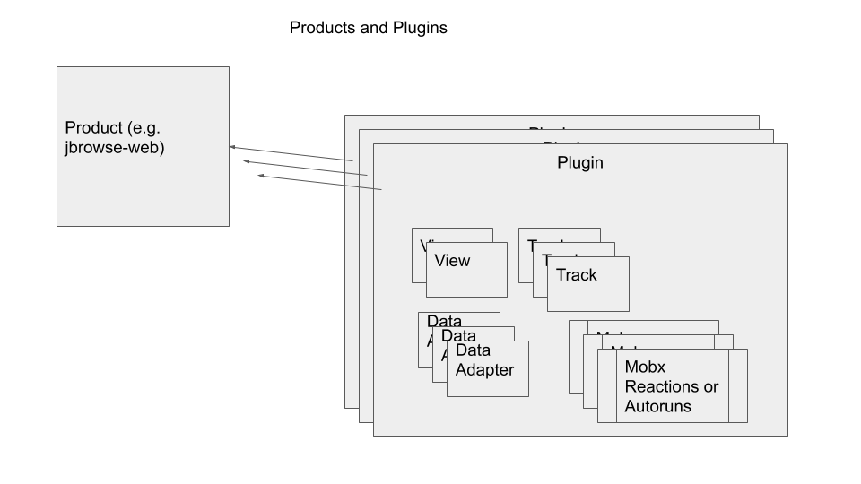

Let's get a high-level view of the JBrowse 2 ecosystem.

## Products and plugins

The JBrowse 2 ecosystem has two main type of top-level artifacts that are published on their own: products and plugins.

Architecture diagram of JBrowse 2, showing how plugins encapsulate views (e.g. LinearGenomeView, DotplotView etc.), tracks (AlignmentsTrack, VariantTrack, etc.), data adapters (BamAdapter, VcfTabixAdapter, etc.) and other logic like mobx state tree autoruns that automatically add logic to other parts of the app (see context menu items). A product such as jbrowse-web or jbrowse-desktop loads various plugins at runtime.

A "product" is an application of some kind that is published on its own (a web app, an electron app, a CLI app, etc). `jbrowse-web`, `jbrowse-desktop`, and `jbrowse-cli` are products.

A "plugin" is a package of functionality that is designed to "plug in" to a product **at runtime** to add functionality. These can be written and published by anyone, not just the JBrowse core team. Not all of the products use plugins, but most of them do.

Also, most of the products are pretty standard in the way they are constructed. For example, jbrowse-web is a React web application that is made with [Create React App (CRA)](https://create-react-app.dev/), and jbrowse-cli is a command-line tool implemented with [OCLIF](https://oclif.io/).

## What's in a plugin

A plugin is an independently distributed package of code that is designed to "plug in" to a JBrowse application.

It's implemented as a class that extends `@gmod/jbrowse-core/Plugin`. It gets instantiated by the application that it plugs into, and it has an `install` method and a `configure` method that the application calls. This class is distributed as a webpack bundle that exports it to a namespace on the browser's `window` object specifically for JBrowse plugins[^1].

It's common for a plugin to use have its `configure` method set up [mobx autoruns or reactions](https://mobx.js.org/refguide/autorun.html) that react to changes in the application's state to modify its behavior.

Plugins often also have their `install` method add "pluggable elements" into the host JBrowse application. This is how plugins can add new kinds of views, tracks, renderers, and so forth.

[^1]: This means it's only possible to have one version of a particular plugin loaded on any given webpage, even if multiple products are loaded and using it on the same page.
