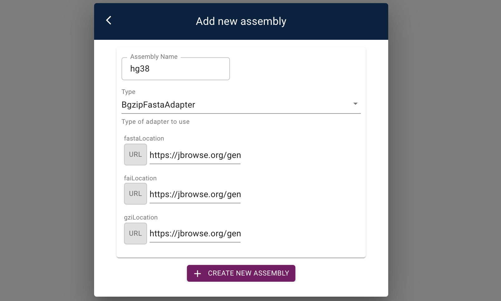
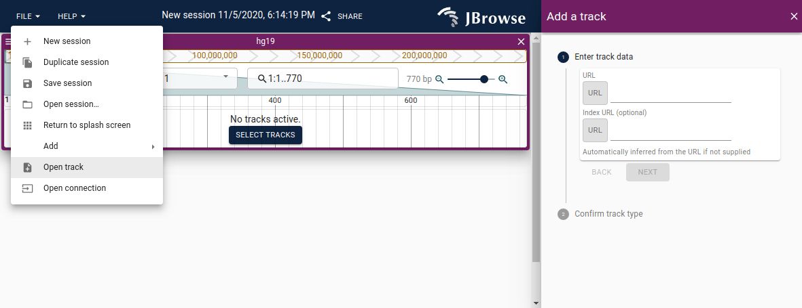
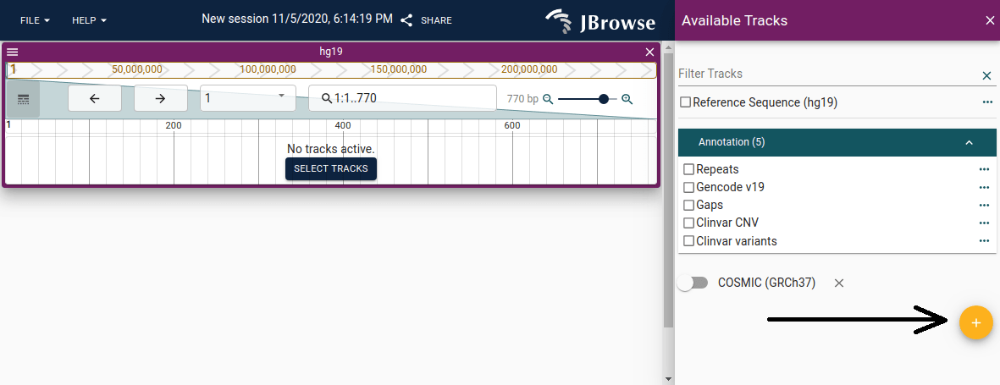

In order to display your data, JBrowse 2 needs to know about the reference
genome for your organism of interest and needs to have tracks created that
reference your data sources. This guide will show you how to set those up using
the JBrowse 2's graphical configuration editing.

:::note

You can also do this configuration with JBrowse CLI. See that guide
[here](quickstart_cli).

:::

## Pre-requisites

This tutorial requires having the following software installed

- [JBrowse CLI](quickstart_web#install-the-cli-tools)

- [JBrowse 2 web application](quickstart_web#using-jbrowse-create-to-install-jbrowse)

## Starting JBrowse 2 admin server

The JBrowse CLI contains a tool called `admin-server`. This will act as a web
server for JBrowse 2 and will write any changes made in JBrowse 2 to a config
file. The `admin-server` is meant to be run only temporarily to help you set up
your config, it is not used for serving your jbrowse instance in production.

The `admin-server` launches an instance of JBrowse 2 in "admin mode", which then
lets you

- Add and edit assemblies with the "Assembly manager"
- Add tracks and edit tracks
- Add and edit connections

All of these changes will be written by the server to the JBrowse config file
(usually `config.json`) located in the JBrowse instance. This is something that
can only be done while the `admin-server` is running, which again, is only meant
to be temporary!

To start the `admin-server`, navigate into your JBrowse 2 directory and run

```sh-session
## Start the admin-server
jbrowse admin-server
```

This will then generate a link that you can visit in your web browser


:::warning

Note: the admin-server is meant to be used temporarily for configuration, not in
production

:::

## Adding a genome assembly

A key first step in configuring a genome browser is adding an assembly to view.
In order to do this, use the navigation bar to open up the Assembly Manager
(`Admin > Open Assembly Manager`).

This opens up a table which can be used to create, edit, and delete assemblies
in your application


Let's add the hg38 human reference genome to our JBrowse 2 application.

Press the "Add New Assembly" button, and enter `hg38` as the assembly name in
the text field



Click on "Create New Assembly". Great, we've added an assembly! Now, in the
configuration editor, add an alias, and configure the adapter to point the hg38
genome hosted by JBrowse:

- fasta: `https://jbrowse.org/genomes/GRCh38/fasta/hg38.prefix.fa.gz`
- fasta index: `https://jbrowse.org/genomes/GRCh38/fasta/hg38.prefix.fa.gz.fai`
- gzi: `https://jbrowse.org/genomes/GRCh38/fasta/hg38.prefix.fa.gz.gzi`

 Figure showing the settings

After clicking the back arrow to return to the table of assemblies, we see that
we have successfully added the hg38 assembly.

 Figure showing the assembly manager

The assembly can be edited or deleted, but for now we will return to the
application.

### Editing a genome assembly

After you've added a genome assembly, you can use the pencil icon button in the
Assembly manager to edit that assembly. You can also delete assemblies from the
assembly manager.

## Adding a track

To add a new track or connection, you can use the menu bar in the app to open
the form for adding a track `File > Open Track`:



Alternatively, you can use the action button (circular "+") inside the track
selector to access the "Add track" form.



In the "Add track" form, you can provide a URL to a file to load. Opening files
from your local machine is not supported currently in the JBrowse 2 web app
(JBrowse desktop does allow this, though, and this functionality may be added in
some form in the future)

Paste a URL to a file and optionally provide an index file URL too. The
following file formats are supported

- `tabix`-indexed VCF
- `tabix`-indexed BED
- `tabix`-indexed GFF
- indexed BAM
- indexed CRAM
- BigWig
- BigBed
- Hi-C (Juicebox)

For tabix files, TBI or CSI indexes are allowed. CSI or BAI is allowed for BAM.
Only CRAI is allowed for CRAM. The index will be inferred for BAI or TBI files
as e.g. filename+'.bai'. If it is different from this, make sure to specify the
index file explicitly.

### Editing a track

First we will open a Linear Genome View using the navigation bar
(`File > Add > Linear Genome View`), and click on the "Select Tracks" button.

The configuration settings are accessible by clicking on the ellipses by each
track.

 Figure showing the configuration editor

Open the configuration editor for the track by clicking on the "Settings" button
shown above. You can use the configuration editor to live-edit any configurable
value for a given track.

## Additional resources

There are a number of additional features for configuring JBrowse 2. Make sure
to refer to the [config guide](config_guide.md) for topics such as
[adding tracks](config_guide.md#adding-tracks-and-connections) or
[adding an assembly with the CLI](config_guide.md#adding-an-assembly-with-the-cli)

## Conclusion

This quickstart showed how to launch the `admin-server` in the JBrowse CLI to
perform graphical configuration of your application. Specifically, we looked at
how to access and use the assembly manager, as well as how to access the
configuration editor for tracks. Importantly, all tracks have different
configuration options available in the configuration editor.

Make sure to take a look at any tracks you add to JBrowse 2 that you might want
to further configure!
