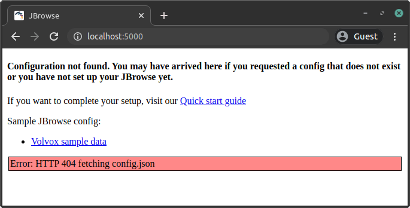
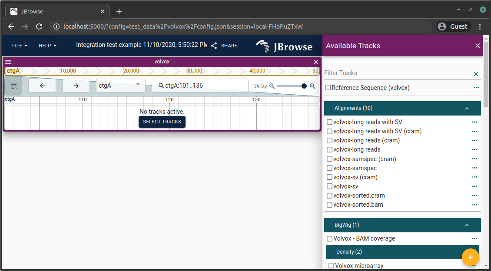

import TOCInline from '@theme/TOCInline';

<TOCInline toc={toc} />

In this guide, we'll get an instance of JBrowse running on your computer.

## Pre-requisites

- Ability to run commands on the command line
- Node.js 10.4+

:::caution

If you are using `apt` as your package manager, we recommend not using it to
install Node.js. Good alternatives include
[NodeSource](https://github.com/nodesource) or
[NVM](https://github.com/nvm-sh/nvm).

:::

## Download

You can download JBrowse 2 by using the JBrowse CLI or by downloading and
unpacking it manually. We recommend using the JBrowse CLI since it also includes
utilities to help you configure JBrowse 2 once it is set up.

### Downloading using the JBrowse CLI

The JBrowse CLI can help perform many tasks to help you manage JBrowse 2, such
as:

- create a new instance of JBrowse 2 automatically
- update an existing instance of JBrowse 2 with the latest released version
- configure your JBrowse 2 instance

#### Installing the CLI tools

To install the JBrowse CLI, run

```sh-session
npm install -g @jbrowse/cli
```

After running this command you can then test the installation with

```sh-session
jbrowse --version
```

This will output the current version of the JBrowse CLI.

:::note

If you can't or don't want to globally install the JBrowse CLI, you can also use
the [npx](https://nodejs.dev/learn/the-npx-nodejs-package-runner) command, which
is included with Node.js, to run JBrowse CLI without installing it. Simply
replace `jbrowse` with `npx @jbrowse/cli` in any command, e.g.

```
npx @jbrowse/cli --version
```

:::

#### Using `jbrowse create` to download JBrowse 2

In the directory where you would like to download JBrowse 2, run this command

```sh-session
jbrowse create jbrowse2
```

### Downloading manually

You can also download JBrowse 2 manually. Go to the
[releases page](https://github.com/GMOD/jbrowse-components/releases/) of the
JBrowse 2 GitHub repository and find the latest release that is tagged
`@jbrowse/web`. Download the ZIP file from that release. Make sure it is the ZIP
file that starts with `jbrowse-web-` and not the "Source code" ZIP file. Once
you have downloaded the ZIP file, extract it to the location you would like to
have JBrowse 2.

### Checking the download

Whether you used the JBrowse CLI or downloaded manually, the directory where you
downloaded JBrowse should look something like this:

```txt
jbrowse2/
├── a586bb28a5bad4a3aba2.worker.js
├── a586bb28a5bad4a3aba2.worker.js.LICENSE.txt
├── a586bb28a5bad4a3aba2.worker.js.map
├── asset-manifest.json
├── favicon.ico
├── index.html
├── manifest.json
├── precache-manifest.52c8ba3337cf7ae812b37d874b2de030.js
├── robots.txt
├── service-worker.js
├── static/
└── test_data/
```

## Running JBrowse 2

JBrowse 2 requires a web server to run. It won't work if you try to directly
open the `index.html` in your web browser. We can use a simple server to check
that JBrowse 2 has been downloaded properly. Run

```sh-session
cd jbrowse2/
npx serve .
```

This will start a web server in our JBrowse 2 directory. Navigate to the
location specified in the tool's output. It will look something like
`http://localhost:5000`. Once at that page, you should see a page that says that
the configuration is not found. That is expected, since we haven't configured
JBrowse 2 yet. It will look something like this:



Go ahead an click on the sample config to see a JBrowse 2 running with a demo
configuration. It should look like this:



Congratulations! You're running JBrowse 2.

## Next steps

Now that JBrowse 2 is set up, you can configure it with your own genomes and
tracks. There are two ways you can configure JBrowse 2: with the JBrowse CLI
(guide [here](quickstart_cli)) or with JBrowse 2's built-in graphical
configuration editing (guide [here](quickstart_gui)).
