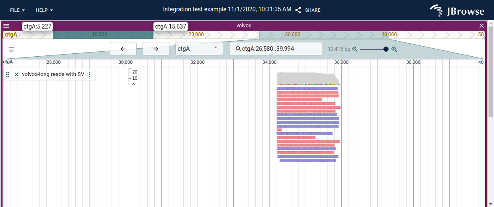
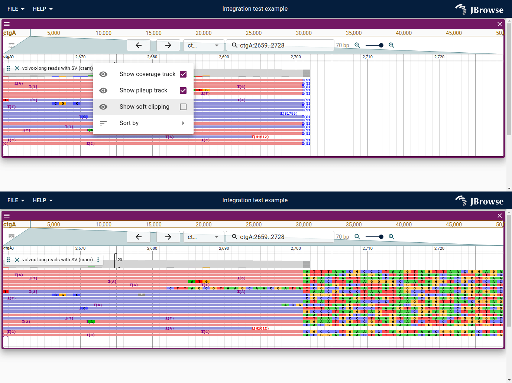
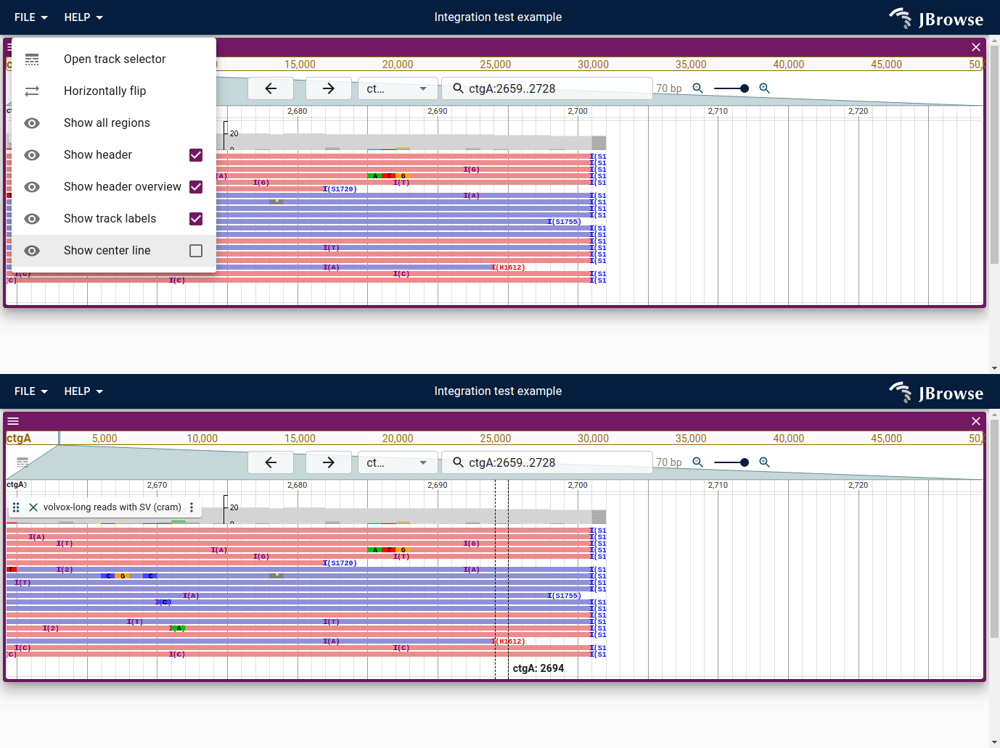
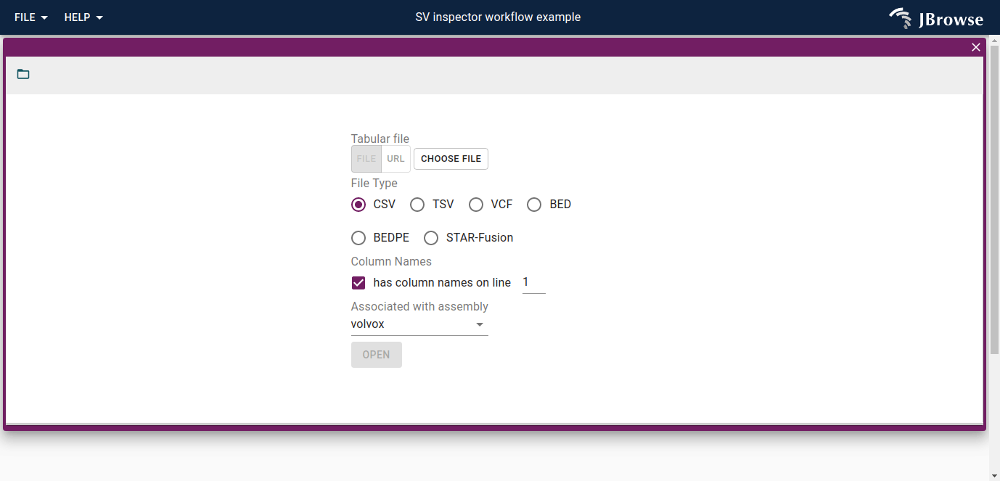
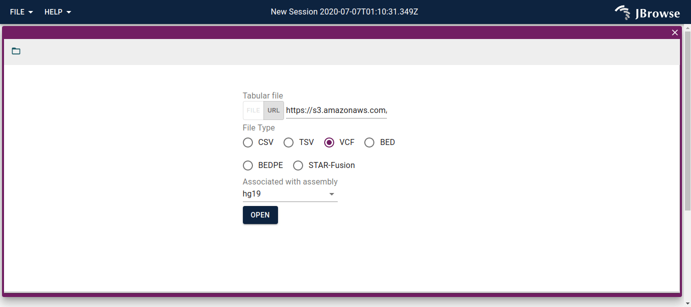
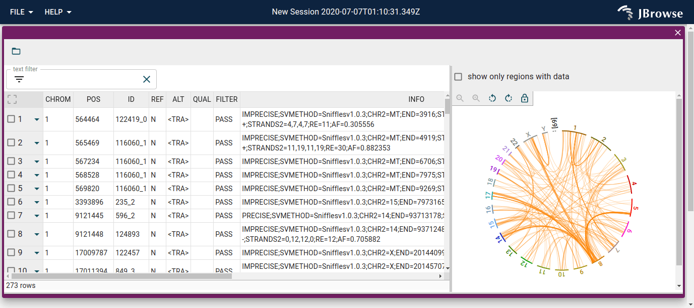
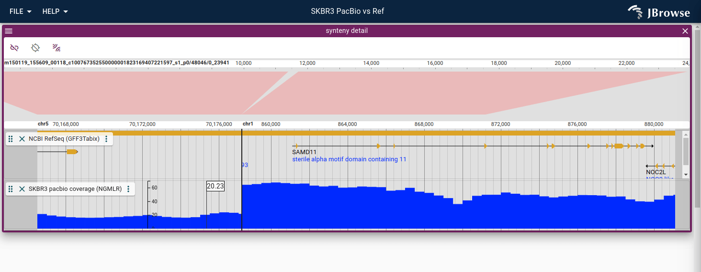

## Navigating the UI

### Linear genome view usage

To start a linear genome view, use the menu bar

File->Add->Linear genome view

#### Using the location search box

- Use the search box in the LGV
- Enter syntax chr1:1-100 or chr1:1..100
- You can also specify an assembly name with the locstring {hg19}chr1:1-100

Note: searching by gene name is not yet available but will be added soon!

#### Scrolling

Mouse wheel can scroll side to side, as well as click and drag. The pan buttons
also exist in the header of the linear genome view

#### Zooming

The zoom buttons exist in the header of the linear genome view, and there is
also a slider bar to zoom in and out.

Note: You can also hold the "Ctrl" key and use your mousewheel or trackpad to
scroll and this will zoom in and out

#### Re-ordering tracks

There is a drag handle on the track labels indicating by the six dots, clicking
and dragging on this part of the track label can reorder tracks

#### Rubberband selection

The scale bars accept a click and drag action to select a region

<!--
https://s3.amazonaws.com/jbrowse.org/code/jb2/master/index.html?config=test_data%2Fvolvox%2Fconfig.json&session=share-6_PDCGXnZY&password=sufpR
-->

Rubberband selection can be performed on both the region and overview scale bars

#### Horizontally flip

The view can be horizontally flipped, or reverse complemented, to make the
coordinates go from right to left instead of left to right

We use triangles pointing in the direction of the orientation in the overview
bar to help indicate whether the app is horizontally flipped or not

Here is an example of before and after horizontally flipping the view

Before horizontally flipping

After horizontally flipping

## Alignments tracks

Visualizing alignments is an important aspect of genome browsers. This guide
will go over the main features of the "Alignments track"

The alignments track is a combination of a pileup and a coverage visualization

### Pileup visualization

The pileup is the lower part of the alignments track and shows each of the
reads as boxes positioned on the genome.

By default the reads are colored red if they aligned to the forward strand of
the reference genome, or blue if they aligned to the reverse strand.

### Coverage visualization

The coverage visualization shows the depth-of-coverage of the reads at eacposition on the genome, and also draws using colored boxes any occurence of
mismatches between the read and the reference genome, so if 50% of the reads
had a T instead of the reference A, half the height of the coverage histogram
would contain a 'red' box

<!--
image info:
window.innerWidth
1378
window.innerHeight
513
https://s3.amazonaws.com/jbrowse.org/code/jb2/alpha/master/index.html?config=test_data%2Fconfig_demo.json&session=eJztVctu2kAU_RU0q1Yixjbh5V0e5NFSioA2UqsKje2LPYk9tmYGSIL8770zJsYkRF1U6qoLFtzXOXN8Zu6WcJoC8cgYNo0ZSMky3nBt1z6xeyd2d-7aXsf17IFlO70fpElSKiLGiWc3SSjoBsQdC1VMvHb_tEnWDDaSeD-3hIU48u75Sn1yJ_c-9oVM5gl9GpdgceQMMKiecv1vxDhQcQ08S-E7jsBMtlxKUJNH4jnt027X6nR7_U7HcQY9u9Mkfj4BYZLVYAinECH3El7Acofk4DCpqFCGMnDk5Z4O3I7ddbFZwBqEBAwuaSKhSaiUkPrJAc_iFzIVNHioHe2b0x9GjjMc7U9xlrCIp8CVnOtiTMTAohiB3QFqE2R8yaKVoApZYjmP0kRg0YQlsMrLFq8SbhEl12rUH-7H1-v2ox3bfjN6e7zFHOE2fIFe5CaLiZ0BZp_Pp-1GTgOfZY0P4-svo-nHRlVUF0brUEqDygRUQZSJJx0zI3SQhjRXIGpczml6tgvi96PpKAsquivBtNZK5dJrtWTboil9zjjdSCvI0ta9L7KNBCsTUSsyJpEtjd4SQEO5wKPIB1-0rSVdmJOd2JZrtRcpzXMILcQiRZMwHsKjBkv-ITD-GCmKQhsN8QV6TcOW32W6C735YFUC-2br6AqoWgk4Un4kWRi02XhykaGzaQSHxkqSYJjOzmTK98Z6U7x316D_vrmOtL12mOR5sCv5g80OK__WazVqe8_Jlf_flQeufG3LmmzHzHYka2ZISCBQ-v3VUcYjLNZnk3G2eekgnhIrKGOlycuIflpjFsINUtdou1d4H_qK_XqrVCnjsZmBzMS8pBYzBBFBzAKakBLEWHJEfUhkHfsCn2cQet_sBmoC1R6LQBkh6vPmdbzqHr1fUV2rm_dKLmtwRN-vJKG52UFbVG3JEmQ4h0elZSxX6sEq1ZLTQLE1XL7iXZjLyhEEjXTLcevxAEyi-A3q17Nj
-->

Screenshot showing the alignments track, which contains both a
coverage view at the top and a pileup view at the bottom

### Show soft clipping

If a read contains bases that do not map the the genome properly, they can
either be removed from the alignment (hard clipping) or can be included, and
not shown by default (soft clipping)

JBrowse 2 also contains an option to "show the soft clipping" that has occured.
This can be valuable to show the signal around a region that contains
structural variation or difficult mappability

<!--
image info:
window.innerWidth
1378
window.innerHeight
513
http://localhost:3001/?config=test_data%2Fvolvox%2Fconfig.json&session=eJztVVFv2jAQ_ivIT5sENAHaoryxdms7VR0qrJs0Tcgkh-M1cTLbCTCU_76zQ5N0pFWr7XEvkXx33_edL5_tHRE0BuKRK6GBSap5IjoalO7AhsZpBKRLYioZF8RzuiSQdA3yCw90SLzheNQlOYe1It63HeEB0vCaZmFoEK63qRG45gKovACRxHCHIMwkq5UCPd0Qb3Dijkb9oTMYDN3T8fhkeNwly3QK0iSdvovKXKUR3UJwCwzJS0kJq5uyfV-zCTIqTaW2nYLAdo4dx0GshBykAgysaKSgS6hSEC-j7R6cJ1GebEjxHZuV1L9v7Icx9-P7H4uv63ojk4gzEYPQam6KMRECZyHKDo5R2E_EirOsnEFF3osSwXoSaKB6Ku_5ksYInPIIsrSk8faKm9j9fJ8Fp25YSzbrajnXOZTbtUPstq6C59pZpBaBxaI5FVvZsZWdNddhZ3bXeWPq33YqQHOcZnYPA8V5-hT9kMitidaDMxka0FSDbLR8hqyTfRSRuLpO_GpfmeRYYzy1CKimR6XGUdt--na8heXgf8NhPtwQKfiZgfBhctD0fJ2847puW9v1i0X7gyXXpCgK41IRgESjGlD5-273oYP_WiUQN8vZB6A6k9BS3pIsrNrsZnqW4LGgDB77T7Nfq_MLeTPa1P47KK5NOHrGgy2wlxhRidTfw17hxseof2TJxg7qX6yy5X_zPjLvn-5tjK3Nky1Zy6EgAl-bK95EuWBYbDcQJusHBPG0zKCMlWehjJjLO-QBXOIIjNr-pq9DnxBvHqsqZa04s5KJnJethRxFpB9yn0akFLHOvaZLiFRT-wxNA9I8antC00D1PDLQdhBNvnlTrzpuT1dUp-_yqZLzhpwxXRJFNLXv3A6ntuIRdjiHjTZjLF_qthfaTJ76mudw_or2n8kV9kYQuECNK4FvMprP8BXFb9Ec-8Q
-->

Shows what turning on soft-clipping enables for a simulated long-read
dataset. There is a simulated structural variant, a deletion, at this position,
so the read has bases that map to the other side of the deletion being revealed
by this.

### Sort by options

The alignments tracks can also be configured to "sort by" a specific attribute
for reads that span **the center line**.

By default the center line is not shown, but by showing it (Go to the view's
hamburger menu->Select "Show center line") then you will obtain a better idea
of what the "sort by" option is doing

### Showing the center line

Here is how to turn on the center line

1. Open the hamburger menu in the top left of the linear genome view
2. Select "Show center line"

<!--
http://localhost:3001/?config=test_data%2Fvolvox%2Fconfig.json&session=eJzNVU1vm0AQ_SvWnmmCQz65pYmapHJcJ7GaVlVljWEMKy8L2l0TLIv_3llwAMckh6qHHnzwzJt58_GY3TAJCTKf3UmDkQLDUzkwqM0AC0gygcxhCaiIS-a7DgsVvKB65qGJme-dHzss5_iimf9rw3hIaXibZmbTULhZZ5ZgxCWCukGZJvidgsiTLhYazaRg_vDc9Y7ODi6G3pHnnXpn5w6bZxNU1uceuPQ35DoTsMbwESNKXlMqXIzr8gMTXVJGbUCZqlKUVM6J67pDh2A5Ko1kWIDQ6DDQGpO5WG-D81TkacHK31SsgmDZ6adY3l9M5DK_bRu5FDySCUqjpxZMjhh5FBPt0QkRB6lc8GhVz6BJPptDQsgJF7jK6jh_S_FzdHLj_Rjfr4uWo4tr8w_d_fyb_pCqj7twh3-WVRDyym7fn3SqDIYHhBg0iO6E7DheZ0QjCoBWnKq1tbazsB4IITOoOkV9huRya6SNQjJKg6buleKEsCKZhWDgsGY43CuKlQ7JKsTCBom_SEA_zsqytEKgPIq0YMPrgT1uTXuTbBwU95RHXxDMSmEPvMdZVmxP48lVSsqDCHc3jsdfn29OJw-dr2MP2279-IOl94T1bl7LLNjiPlr_LuwfaaBTY6sFvZr_52p5K5dOG30i6PFWOTQKDIw9W9bKZURgW6OO05fXCOYbtcLaVouvttiDFPMQbxFCy7a9Xq3pG8XbA9y4quU_VZSpmtalxZxIVBDzAASrSSqtjGCOQne5r2iJqOyhbvmbix-hqebQTTft0jXyfh_RyP32Pch1h45Z3QsBWXW6NzS0BRdU4BQLY6dYPz59j44dPASG53j9pvyy-pYkcRH4TtJ7IQOsHOUf_vx6KA
!-->

Illustrates before and after turning on the center line. The center line is an
indicator that shows what base pair underlies the center of the view. Note that
this is used in the "Sort by" option discussed below; the sort is performed
using properties of the feature or even exact base pair underlying the center
line

### Sorting by base

Sorting by base will re-arrange the pileup so that the reads that have a
specific base-pair mutation at the position crossing the center line (which is
1bp wide) will be arranged in a sorted manner. To enable Sort by base

1. Open the track menu for the specific track using the vertical '...' in the
   track label
2. Select 'Sort by'->'Base pair'

<!--
http://localhost:3001/?config=test_data%2Fvolvox%2Fconfig.json&session=eJzNVcFO20AQ_RW0Zzc4JBTwLYAoSJRGkLZSqyqaeCfrFeu1tbsxiSL_O7N2sA0xHKoeeuCQmTfz3s48xlumIUUWsRvtUBhwMtMHDq07wDWkuUIWsBSMkJpFYcC4gSc0PyV3CYtGp-OAFRKfLIt-b5nk1Ea2bea-DZW7Te4JbqVGMF9QZyn-oCLKZMulRTdds2h4Go6OTgZnw9HRaPR5dHIasEU-ReNz4SCkn1zaXMEG-T0Kal5TGlze1fJjJybU0TowrlKKmuQch2E4DAhWoLFIgSUoiwEDazFdqM2uuMhUka1Z-YfEGogfO-9ZP349m-rH4rp9yERJoVPUzs48mBIJSpEQ7dExEceZXkqxqmfQNJ8vICXkVCpc5XVdtKNIr_gv8R3uxrrl6OLa_sNwv_-2v6R6xw1_xT_PKwhldffdn2xmHPIBIQ4aRHdCfhwvM6IRxUArzszGR9tZ-AxwyB2ajqhzSCe7IG0U0tssbnSvjCSEN8mcg4PDmuFwTxQrA7IVx7UvUn_RgP4kK8vSG4H6GPKCL68Hdr8L7U2ySVDdQyGuENzKYA-8J1lWbA9304uMnAcCX298gsKdXy7iol34Hrbd-viDpfeU9W7e6jze4T5a_2vYP_JAR2PrBbta_OdueWuXzjP6TNCTrXpYVBg7f7Z8VGpBYK_RJtnTSwWLnFlhHavNV0f8QUokx2sE7tl216sNfaN6f4CbVLX8h4oyM7NaWiKJxMSJjEGxmqTyyi0sUNku9wUtEY0_1C1_c_EFumoO3XazLl1j7_cRjd2v34NcduiY971SkFene0tDW0pFAme4dn6K9cen76PjBw-xkwVevpFfVv9LmrgIfKPpe6FjrBLlMyhVeuQ
-->

Illustrating the pileup re-ordering that happens when turning on the
"Sort by"->"Base pair". The sorting is done by specifically what letter of each
read underlies the current center line position (the center line is 1bp wide,
so sorted by that exact letter)

There are other sorting options available and more to come. If you have any
requests please drop us a line via github
[here](https://github.com/GMOD/jbrowse-components/issues)

## BigWig tracks

Visualizing genome signals, whether it is read depth-of-coverage or other
signal, can often be done by using BigWig files

This figure shows a BigWig using the XY plot renderer

Line plot version of a BigWig

There are many options for controlling the BigWig which can be accessed from
the UI. See the [bigwig configuration guide](config_guide#wiggle-config)

## Dotplot view

The dotplot view is a 2D comparative view that can display alignments between
different genome assemblies, or even compare a long-read or NGS short-read
versus the genome

### Opening the dotplot view

Currently the workflow for launching a dotplot is done by navigating in the
header bar to the File->Add->Dotplot view

This will let you select the genome assemblies of interest

Then you can also provide a synteny file in the form of PAF via the Add track
workflow

Then currently you must configuration edit the PAFAdapter to indicate the two
assemblies in the PAFAdapter

Example of a dotplot visualization of the grape vs the peach genome

See the [dotplot configuration](config_guide#dotplot-view-config) for more
detailed descriptions

## Long read vs reference plots

One can also launch a dotplot view that compares a long read to the reference
genome by

- Right clicking an alignment
- Select "Dotplot read vs ref" or "Linear read vs ref" in the context menu

Example of a dotplot of a long read vs the reference genome

Example of a "synteny" view of a long read vs the reference genome

## Hi-C tracks

Visualizing Hi-C data can be performed with .hic files which are generated by
the Juicebox software suite. It uses the hic-straw module developed by the
juicebox/igv.js team to visualize it in jbrowse.

Currently configuration options are basic for Hi-C tracks, see
[configuration](config-guide#hi-c-config) for info about configuring Hi-C
tracks

<!--
image info:
window.innerWidth
1378
window.innerHeight
513
https://s3.amazonaws.com/jbrowse.org/code/jb2/alpha/master/index.html?config=test_data%2Fconfig_demo.json&session=eJztVctu2kAU_RU0q1Yixjbh5V0e5NFSioA2UqsKje2LPYk9tmYGSIL8770zJsYkRF1U6qoLFtzXOXN8Zu6WcJoC8cgYNo0ZSMky3nBt1z6xeyd2d-7aXsf17IFlO70fpElSKiLGiWc3SSjoBsQdC1VMvHb_tEnWDDaSeD-3hIU48u75Sn1yJ_c-9oVM5gl9GpdgceQMMKiecv1vxDhQcQ08S-E7jsBMtlxKUJNH4jnt027X6nR7_U7HcQY9u9Mkfj4BYZLVYAinECH3El7Acofk4DCpqFCGMnDk5Z4O3I7ddbFZwBqEBAwuaSKhSaiUkPrJAc_iFzIVNHioHe2b0x9GjjMc7U9xlrCIp8CVnOtiTMTAohiB3QFqE2R8yaKVoApZYjmP0kRg0YQlsMrLFq8SbhEl12rUH-7H1-v2ox3bfjN6e7zFHOE2fIFe5CaLiZ0BZp_Pp-1GTgOfZY0P4-svo-nHRlVUF0brUEqDygRUQZSJJx0zI3SQhjRXIGpczml6tgvi96PpKAsquivBtNZK5dJrtWTboil9zjjdSCvI0ta9L7KNBCsTUSsyJpEtjd4SQEO5wKPIB1-0rSVdmJOd2JZrtRcpzXMILcQiRZMwHsKjBkv-ITD-GCmKQhsN8QV6TcOW32W6C735YFUC-2br6AqoWgk4Un4kWRi02XhykaGzaQSHxkqSYJjOzmTK98Z6U7x316D_vrmOtL12mOR5sCv5g80OK__WazVqe8_Jlf_flQeufG3LmmzHzHYka2ZISCBQ-v3VUcYjLNZnk3G2eekgnhIrKGOlycuIflpjFsINUtdou1d4H_qK_XqrVCnjsZmBzMS8pBYzBBFBzAKakBLEWHJEfUhkHfsCn2cQet_sBmoC1R6LQBkh6vPmdbzqHr1fUV2rm_dKLmtwRN-vJKG52UFbVG3JEmQ4h0elZSxX6sEq1ZLTQLE1XL7iXZjLyhEEjXTLcevxAEyi-A3q17Nj
-->

Screenshot showing a Hi-C track

## SV inspector

The SV inspector is a "workflow" that is designed to help users inspect
structural variant calls

### Opening the SV inspector

We can start the SV inspector by launching it from the App level menu bar

The SV inspector can be launched from the main menu bar

This will bring up an "import form" that asks you for your SV evidence. This
can be provided using a URL in these formats:

- VCF (plain text VCF, not tabix VCF)
- BEDPE
- STAR-fusion result file
- or other formats

SV inspector import form

### Example SV inspector workflow

We can start the SV inspector workflow by opening up this file containing
translocation events called from a breast cancer cell line SKBR3, based on
these published data http://schatz-lab.org/publications/SKBR3/

    ## Example VCF for use in the SV inspector
    https://jbrowse.org/genomes/hg19/skbr3/reads_lr_skbr3.fa_ngmlr-0.2.3_mapped.bam.sniffles1kb_auto_l8_s5_noalt.new.vcf

Copy this URL and paste it into the import form and select hg19

SV inspector import form with URL

### SV inspector results

After loading the user's requested file, you will have a spreadsheet with each
row representing a row of the file you opened, along with a whole-genome
overview of the SVs on the right

SV inspector with loaded results

Now here is where things can become interesting

We can perform searching and filtering on the table, which can filter down the
number of rows being displayed, and then this dynamically filters the circos
view on the right also.

SV inspector with filter applied

### Launching breakpoint split view

By clicking on the features in the Circos, or clicking on the triangle
drop-down on the leftmost column of the spreadsheet, we can dynamically launch
a new view of the data that is called the "split view" or the "breakpoint split
view"

This allows us to inspect the breakpoints of the structural variant, and
compare each side to the alignments.

## Linear synteny view

The linear synteny view allows visualizing matching regions between genomes

### Opening the linear synteny view

Use the main menu bar to select

File->Add->Linear synteny view

Figure showing grape vs peach synteny

See the [linear synteny
configuration](config_guide#configuring-linear-synteny-views) for more details
on manually configuring the synteny view

### Long read vs reference

One can also launch a linear synteny view that compares a long read to the
reference genome

Figure showing a PacBio long read versus the reference genome, with additional tracks

## Variant tracks

Visualizing variant tracks from the VCF format alongside the original alignment
evidence track is a common workflow for validating your results. In JBrowse 2
we can open a variant track and an alignments track as shown below

Variant track indicating a SNP alongside the alignment track evidence

### Variant widget

The variant features have a specialized widget that contains a table
indicating all the calls that were made in a multi-sample VCF. Some VCF files,
like the 1000 genomes VCF, can contain thousands of samples in a single file.
This table can display the details

### Future additions

We anticipate adding more features to the variant track in the future including

1. Ability to visualize individual samples in a multi-sample VCF as subtracks
   of a variant track
2. Ability to use FILTER the VCF column via the track menu
